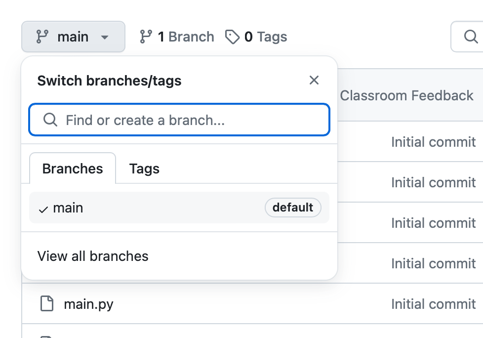
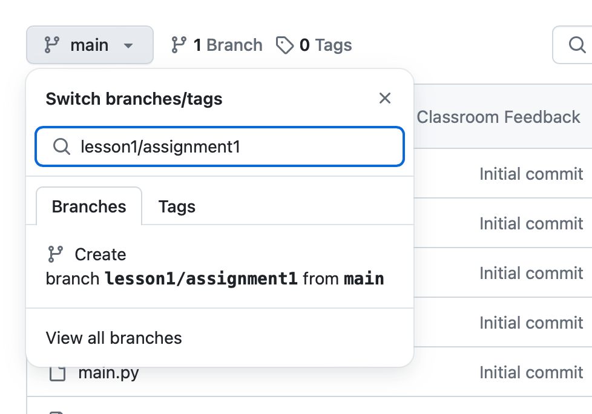
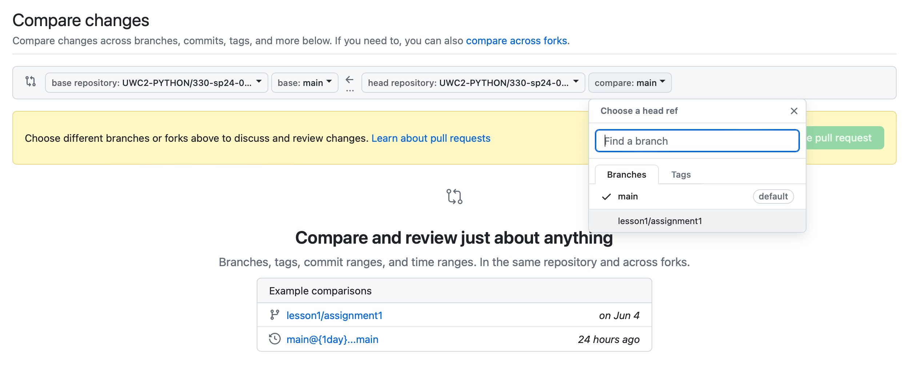

*****************
Feature Branching
*****************

.. note:: Feature branching is an important topic, but not one you need to know about right off. If you are brand new to Git then feel free to ignore this. With GitHub Classroom this should be handled for you.

Why use Feature Branches?
=========================

The idea is to give a clear, highly focused purpose to each branch, which is why we call them feature branches. They represent specific feature being added or in our case a single assignment.

When using feature branches you isolate your code from everything else, and a Pull Request becomes easier to review as they only contain one thing. This also mean that you can work on multiple features (multiple assignments) at the same time without effecting each other and being able to have two separate clean PRs along side.

Keep in mind that in a more professional setting the "main" branch represents production code and will be the cleanest most stable branch.

Below is what's called "Network Graph" of git activity. This displays best what happens with feature branches.

The black line represents main, the green represents my 1st feature branch that got merged into main (labeled as "master" in the picture, you can see arrow goes to black line), then I created second feature branch called "test2" (blue line) and that also got merged into main.

So feature branches get branched off the main branch (main) at some point in time, then you do some isolated work, then merge it back into main branch. No commits to main will affect your work in your feature branch while you're in it.

.. image:: images/feature_branching_img1.png
  :scale: 75

Workflow
========

1. Feature / Assignment Branch
------------------------------

Below explains the process for creating your feature branch. You can either use the command line or the UI.

Creating feature branch via Command Line
........................................

First make sure you're on main and make sure you have the latest changes:

.. code-block:: bash

    $ git checkout main

    $ git pull

Next you will create a new branch (-b flag) based of main:

.. code-block:: bash

    $ git checkout -b <new_feature_branch_name>

Here is the full example:

.. code-block:: bash

    $ git checkout main
    Already on 'main'
    Your branch is up to date with 'origin/main'.

    $ git pull

    $ git checkout -b lesson1/assignment1
    Switched to a new branch 'lesson1/assignment1'

.. code-block:: bash

    $ git branch
      branch_name1
      another_branch
    * lesson1/assignment1 <------- The asterisk here indicates your current branch
      main

That's it. You are now on an isolated feature branch, do your work and make commits to this branch. There should be no difference.. when you're ready to push your changes you would now push to your feature branch instead of main:

.. code-block:: bash

    $ git push origin <new_feature_branch_name>

Creating Feature Branches via GitHub UI
.......................................

Navigate to your forked GitHub repo and identify Branch dropdown:

Initially you should only see main branch listed. Within that dropdown type the name of the new feature branch, for this example we will call it ``lesson1/assignment1``

Once you start typing the name of the branch, and if it does not currently exist, you will get a prompt to create new branch. Click into highlighted area (colors may differ based on browser or theme) and now you have a new branch!

Go into command line and check out this new branch:

.. code-block:: bash

    $ git pull

    $ git checkout lesson1/assignment1
    Switched to branch 'lesson1/assignment1'

    $ git branch
    feature_branch
    * lesson1/assignment1 <------- asterisk here indicates your current branch
    main

    $

2. When Feature Work is Complete
--------------------------------

When you're done working on your feature branch it is time to create a Pull Request to get your changes into main branch (both main class repo and fork).

Create PR into Main Repository
..............................

In the GitHub UI navigate to Pull Requests and select New pull request button, you should now see options for source/target and branches

In the far right dropdown you will want to select your feature branch. Create the PR.

Merge your feature branch into *your forked* main branch
..........................................................

Command Line
^^^^^^^^^^^^
Note that you can always verify you are in your forked version by running the command below which should show URL of origin:

.. code-block:: bash

    $ git remote show origin

Now check out main and make sure it is up to date:

.. code-block:: bash

    $ git checkout main

    $ git pull

Next merge your feature branch (in our example ``lesson1/assignment1`` into main.

.. code-block:: bash

    $ git merge --no-ff lesson1/assignment1

Next you will be prompted to commit with pre-populated commit message, then save and close.

Finish up with your work by pushing it to GitHub:

.. code-block:: bash

    $ git push origin main

GitHub UI
^^^^^^^^^

If you're not comfortable with command line, it is very easy to do in the GitHub UI!

Navigate to Pull Requests again, and press New Pull request button, you will now select your fork on the far left with main branch, and your feature branch on the far right.

.. image:: images/feature_branching_img5.png
     :scale: 50

.. note:: You  may not see exactly the same interface. If you want to see the full base repository and head repository, click the link that says "compare across forks" to toggle that information.

Create your pull request, then merge it and delete feature branch.

Extensive Explanation of Feature Branching
==========================================

It has been said that git is not a Revision Control System, but rather, a tool you can use to make a Revision Control System. What this means is that git provides a huge number of features for managing your source code, but you still need to decide how to use it for your particular project. This is often referred to as the git "workflow". The "feature-branch" workflow is one such approach to managing a project.

Here are a couple nice references that explain the feature branching workflow:

https://www.atlassian.com/git/tutorials/comparing-workflows/feature-branch-workflow

https://blog.landscape.io/use-feature-branches-for-everything.html
